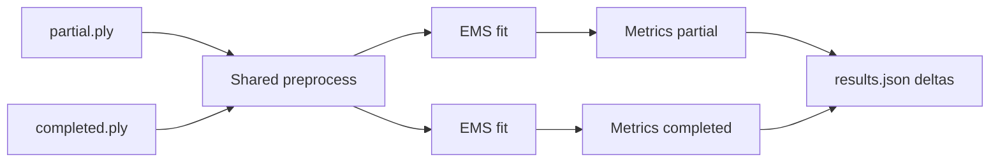

# EMS Shape Completion Bridge

Reproducible pipeline for [EMS superquadric fitting](https://arxiv.org/abs/2111.14517) (Liu et al., CVPR 2022). It compares **partial** point clouds (before shape completion) against **completed** point clouds (after shape completion) using the same EMS fitting pipeline, so you can test whether completion improves superquadric quality and downstream manipulation.

**Stack:** Python 3.11, pixi, file-based I/O (no ROS).

---

## What you are comparing

The thesis hypothesis is:

> Shape completion produces cleaner, more complete geometry → EMS fits superquadrics better → downstream grasp/planning performs better.

This repo handles the **EMS fitting comparison** step. For each object you run:

| Arm | Input | Meaning |
|-----|--------|---------|
| **Partial** | Raw or partial-view point cloud | What the robot/sensor sees before completion |
| **Completed** | Shape-completion output | What your completion method produces |

Both arms go through **identical** preprocessing and EMS settings (from [`config/params.yaml`](config/params.yaml)). Only the input cloud differs. That keeps the comparison fair.



---

## Setup

### Prerequisites

- [pixi](https://pixi.sh/) installed
- macOS or Linux (tested on macOS arm64)

### Install

```bash
cd testing_ems
pixi install
```

The upstream EMS code lives in `vendor/EMS-superquadric_fitting/` (committed in this repo, patches pre-applied). `pixi run reproduce` (and other tasks) install it editable via pip on first run.

### Sanity check (optional)

Verify EMS works on bundled demo clouds:

```bash
pixi run reproduce
```

Outputs go to `results/reproduce/`.

---

## Prepare your data

### Input requirements

- Object-only point cloud (no background)
- At least 11 points
- Same coordinate frame and units for partial and completed pairs (e.g. meters)
- Formats: `.ply`, `.npy` (`N×3`), or `.npz` (key `points`)

### Layout option A — folder convention (recommended for batch)

One folder per object, fixed filenames:

```text
data/
├── mug_01/
│   ├── partial.ply
│   └── completed.ply
├── bottle_02/
│   ├── partial.ply
│   └── completed.ply
└── ...
```

`python run.py --batch data` auto-discovers every subdirectory that contains both `partial.ply` and `completed.ply`.

Filenames are configured in `config/params.yaml`:

```yaml
input:
  partial_filename: "partial.ply"
  completed_filename: "completed.ply"
```

### Layout option B — flat folders + manifest (flexible paths)

Keep clouds in separate trees and list pairs explicitly:

```text
data/
├── partial/
│   ├── mug_01.ply
│   └── bottle_02.ply
└── completed/
    ├── mug_01.ply
    └── bottle_02.ply
```

Create `config/my_experiment.yaml`:

```yaml
objects:
  - id: mug_01
    partial: data/partial/mug_01.ply
    completed: data/completed/mug_01.ply
    fit_mode: single          # or hierarchical

  - id: bottle_02
    partial: data/partial/bottle_02.ply
    completed: data/completed/bottle_02.ply
    fit_mode: hierarchical
```

Run with:

```bash
pixi run python run.py --batch data --manifest config/my_experiment.yaml
```

### Choosing `fit_mode`

| Object type | Recommended mode | Why |
|-------------|------------------|-----|
| Mugs, boxes, cylinders, simple tools | `single` | One convex superquadric is enough |
| Animals, bottles with cap, multi-part shapes | `hierarchical` | Multiple superquadrics via recursive EMS |

Use the **same** `fit_mode` for partial and completed on a given object.

---

## How to run a comparison (step by step)

### 1. Single object

Compare one partial/completed pair and write results under `results/<object_id>/`:

```bash
pixi run python run.py \
  --partial data/partial/mug_01.ply \
  --completed data/completed/mug_01.ply \
  --mode single \
  --object-id mug_01 \
  --output results
```

**What happens internally**

1. Load both point clouds
2. Preprocess each (optional SOR, voxel downsample to target density — see `config/params.yaml`)
3. Run EMS on each cloud independently
4. Compute fit metrics on each arm
5. Write outputs and delta fields

**Outputs** (`results/mug_01/`):

| File | Contents |
|------|----------|
| `partial.json` | Full EMS result for partial cloud |
| `completed.json` | Full EMS result for completed cloud |
| `results.json` | Side-by-side summary + deltas |
| `partial_visual.ply` | Colored overlay (input + SQ surface), if enabled |
| `completed_visual.ply` | Same for completed arm |

Console prints something like:

```text
mug_01: delta_fit_error=-0.002200 delta_chamfer=-0.001100 delta_coverage=+0.180000
```

### 2. Batch (many objects)

**Folder convention:**

```bash
pixi run python run.py --batch data --output results
```

Writes:

- `results/batch/<object_id>/` — same files as single-object run
- `results/batch/summary.csv` — one row per object with key metrics and deltas

**Manifest mode:**

```bash
pixi run python run.py --batch data --manifest config/my_experiment.yaml --output results
```

Override fit mode for entire batch:

```bash
pixi run python run.py --batch data --mode hierarchical --output results
```

### 3. Demo on vendor data (no completion yet)

To test the pipeline before real completion outputs exist, use the same file for both arms (metrics will be identical):

```bash
pixi run python run.py \
  --partial data/vendor/single/noisy_pointCloud_example_1.ply \
  --completed data/vendor/single/noisy_pointCloud_example_1.ply \
  --mode single \
  --object-id demo_noisy
```

Or use pixi shortcuts:

```bash
pixi run run-single    # single-object demo
pixi run run-batch      # batch on data/ (only objects with partial.ply + completed.ply)
```

---

## Understanding the results

### Consolidated `results.json`

Example structure:

```json
{
  "object": "mug_01",
  "partial": {
    "n_points_input": 4821,
    "n_points_after_preproc": 1288,
    "n_primitives": 1,
    "total_coverage": 0.71,
    "mean_fit_error": 0.0043,
    "chamfer": 0.0031,
    "elapsed_s": 1.2,
    "result_json": "results/mug_01/partial.json"
  },
  "completed": {
    "n_points_input": 8302,
    "n_points_after_preproc": 1500,
    "n_primitives": 1,
    "total_coverage": 0.89,
    "mean_fit_error": 0.0021,
    "chamfer": 0.0020,
    "elapsed_s": 1.4,
    "result_json": "results/mug_01/completed.json"
  },
  "delta_coverage": 0.18,
  "delta_fit_error": -0.0022,
  "delta_chamfer": -0.0011
}
```

### Metric definitions

| Field | Meaning | Better when completed is… |
|-------|---------|-------------------------|
| `mean_fit_error` | Mean point-to-surface distance (input points → fitted SQ surfaces) | **Lower** (negative `delta_fit_error`) |
| `chamfer` | Symmetric Chamfer distance (cloud ↔ surface samples) | **Lower** (negative `delta_chamfer`) |
| `total_coverage` | Mean inlier fraction across fitted superquadrics | **Higher** (positive `delta_coverage`) |
| `n_primitives` | Number of superquadrics (hierarchical mode) | Context-dependent |
| `n_points_after_preproc` | Points after voxel/SOR preprocessing | Informational only |

**Delta sign convention:** `delta_* = completed - partial`

- `delta_fit_error < 0` → completion improved geometric fit
- `delta_chamfer < 0` → completion improved symmetric surface match
- `delta_coverage > 0` → more points explained as inliers

### Per-arm JSON (`partial.json` / `completed.json`)

Contains full EMS output: superquadric parameters (`epsilon1`, `epsilon2`, `scale`, `euler_zyx`, `translation`), inlier fractions, and optional downstream proxy fields (`grasp_candidate_width`, `grasp_feasible`, `planning_proxy_clearance`). Use these for grasp/planning experiments outside this repo.

### Batch summary CSV

`results/batch/summary.csv` columns:

- `object`, `partial_*`, `completed_*` metrics
- `delta_fit_error`, `delta_chamfer`, `delta_coverage`

Import into Excel/Python/R for plots and thesis tables.

---

## Visual inspection

### PNG overlays (matplotlib)

After a run, visualize fit quality:

```bash
pixi run visualize -- \
  data/completed/mug_01.ply \
  results/mug_01/completed.json \
  -o results/mug_01/completed_overlay.png \
  --surface-points 12000
```

SQ-only view:

```bash
pixi run visualize -- \
  data/completed/mug_01.ply \
  results/mug_01/completed.json \
  --hide-cloud \
  -o results/mug_01/completed_sq_only.png
```

Red = input points, blue-tinted = sampled superquadric surface.

### Colored PLY (if enabled)

When `output.save_visual_ply: true` in `config/params.yaml`, each arm also writes:

- `partial_visual.ply` — input (red) + SQ surface (blue)
- `completed_visual.ply`

Open in MeshLab or CloudCompare.

---

## Configuration

All hyperparameters live in [`config/params.yaml`](config/params.yaml).

| Section | Controls |
|---------|----------|
| `input` | Default filenames for batch folder discovery |
| `preprocessing` | SOR, voxel size, target point counts |
| `ems` | EMS single + hierarchical parameters |
| `output` | Results directory, visual PLY export, surface sampling density |

**Presets:** [`config/ems_coarse.yaml`](config/ems_coarse.yaml) uses fewer hierarchical parts (coarser decomposition). Use with `--config config/ems_coarse.yaml`.

**Fair comparison rule:** Use one fixed `params.yaml` for all objects and both arms. Do not tune EMS differently for partial vs completed.

Key preprocessing notes:

- `target_n_points: 1500` (single) / `target_n_points_multi: 5000` (hierarchical) — adaptive voxel downsampling
- `sor_enabled: true` — statistical outlier removal before EMS
- Hierarchical EMS uses `Rescale: false` in EMS (preprocessing handles scale); single mode uses `single_rescale: true`

---

## Recommended thesis workflow

1. **Student:** Run shape completion → write `data/completed/<object>.ply` (or folder convention).
2. **Student:** Place partial clouds in `data/partial/` or `data/<id>/partial.ply`.
3. **Register pairs** in folder layout or `config/my_experiment.yaml`.
4. **Run comparison:**
   ```bash
   pixi run python run.py --batch data --manifest config/my_experiment.yaml
   ```
   or
   ```bash
   pixi run python run.py --batch data
   ```
5. **Analyze** `summary.csv` and per-object `results.json` for:
   - Lower `delta_fit_error` and `delta_chamfer` on average
   - Higher `delta_coverage` on average
6. **Qualitative check:** Spot-check objects with `visualize` or `*_visual.ply`.
7. **Downstream (student):** Use exported superquadrics for grasp/planning and compare success rates separately.

---

## Project layout

```
testing_ems/
├── run.py                 # Main entry: single + batch comparison
├── pixi.toml
├── config/
│   ├── params.yaml        # Primary config
│   └── ems_coarse.yaml    # Optional coarser hierarchical preset
├── data/                  # Inputs (see data/README.md)
├── src/ems_bridge/        # Preprocess, EMS wrapper, metrics, pipeline
├── scripts/
│   ├── reproduce_paper_demo.py
│   └── visualize_fit.py
├── vendor/EMS-superquadric_fitting/
├── docs/INTEGRATION.md    # Student handoff details
└── results/               # Outputs (gitignored)
```

---

## CLI reference

| Command | Purpose |
|---------|---------|
| `pixi run reproduce` | Sanity check EMS on vendor demos |
| `pixi run python run.py --partial A --completed B [--mode single\|hierarchical] [--object-id ID] [--output DIR]` | Compare one object |
| `pixi run python run.py --batch DIR [--manifest YAML] [--mode M] [--output DIR]` | Compare many objects |
| `pixi run visualize -- CLOUD RESULT.json [-o out.png] [--hide-cloud]` | Plot fit |
| `pixi run run-single` | Shortcut demo (vendor single example) |
| `pixi run run-batch` | Shortcut batch on `data/` folder convention |

Common flags:

- `--config path/to.yaml` — override default `config/params.yaml`
- `--output results` — base output directory (default from config: `results`)

---

## Investigation FAQ (from original project questions)

### Preprocessing: ours vs EMS internals?

**EMS already does:** centroid centering, optional rescale, PCA init, probabilistic outliers.

**This pipeline adds before EMS:** optional SOR, voxel downsampling to target density.

Do not disable preprocessing without understanding the interaction with `Rescale` in EMS params.

### Is point count fixed?

No. Target density is set via `target_n_points` / `target_n_points_multi` and adaptive voxel size.

### How many superquadrics?

**Automatic** in hierarchical mode (`MaxLayer`, `MinPoints`, `eps_scale`). Not set manually per object.

---

## Role split

| Pipeline maintainer | Thesis student |
|---------------------|----------------|
| EMS wrappers, `run.py`, configs, docs | Shape completion method |
| Baseline validation | Dataset collection |
| Comparison tooling | Run experiments, analysis, robot eval |

---

## Vendor EMS (bundled)

`vendor/EMS-superquadric_fitting/` is vendored in this repository (MIT license; see upstream [EMS-superquadric_fitting](https://github.com/bmlklwx/EMS-superquadric_fitting)). macOS / NumPy 2.x patches are documented in [`patches/README.md`](patches/README.md) and already applied in the committed copy. Re-apply them only if you refresh vendor from upstream.

---

## References

- Paper: [Robust and Accurate Superquadric Recovery (CVPR 2022)](https://arxiv.org/abs/2111.14517)
- Code: [bmlklwx/EMS-superquadric_fitting](https://github.com/bmlklwx/EMS-superquadric_fitting)
